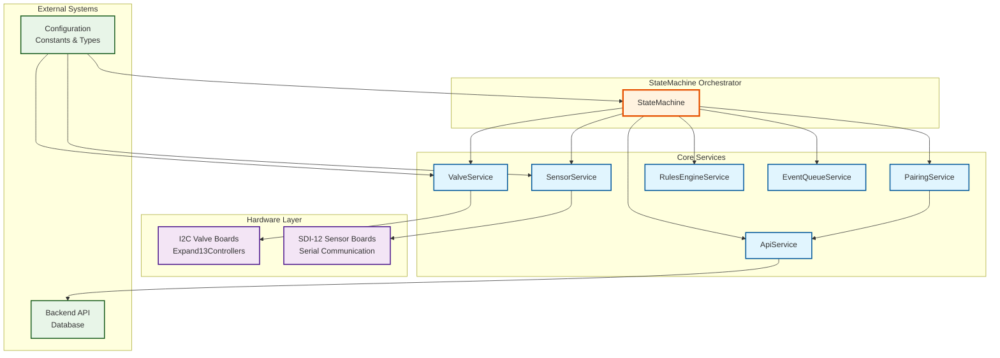
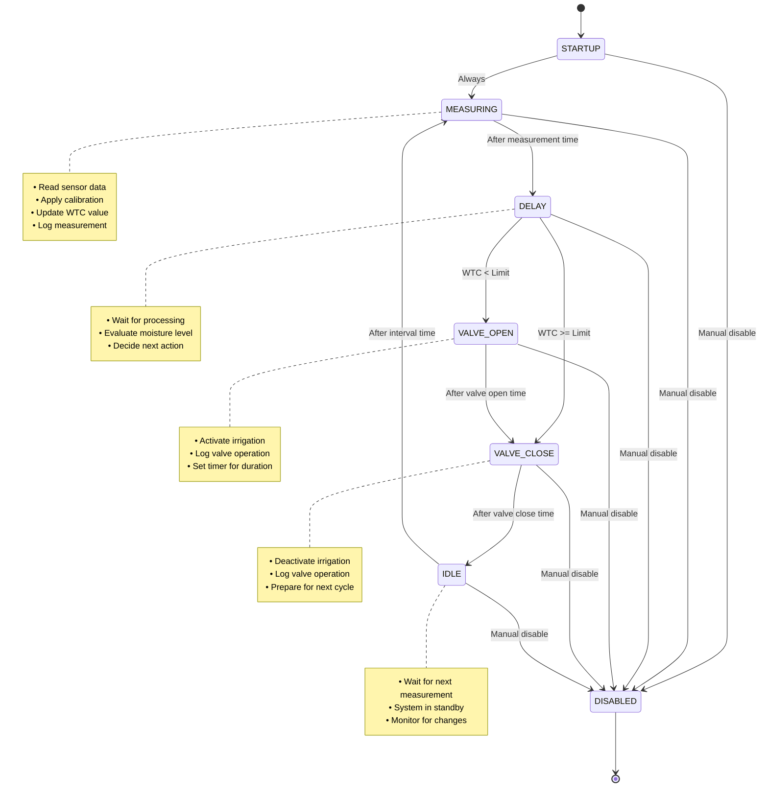
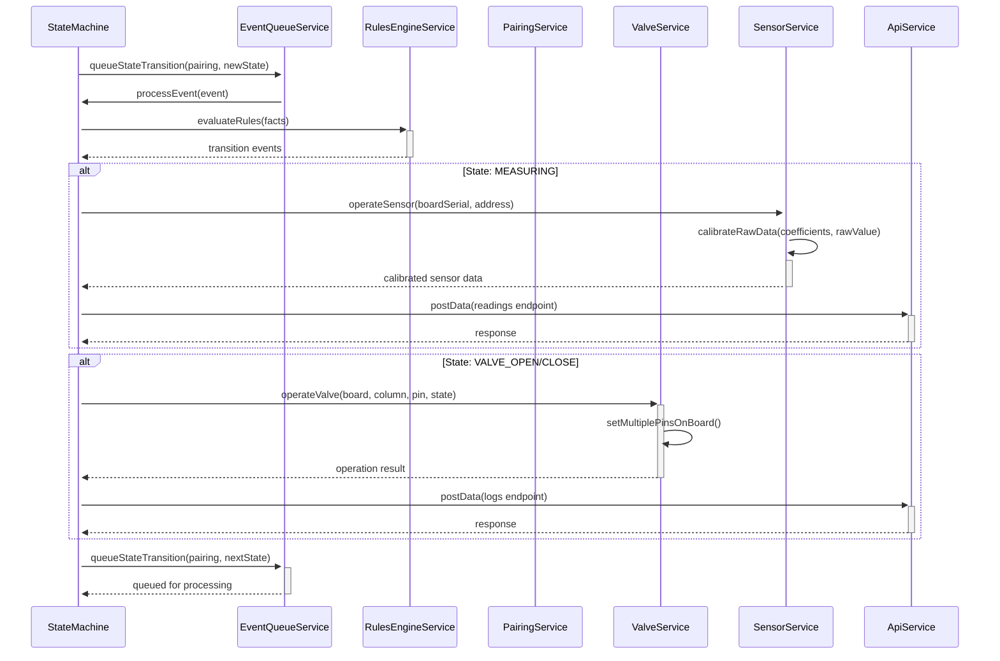

# StateMachine Architecture & Flow Documentation

## 🏗️ Overall Architecture Diagram



## 🔄 State Machine Flow Diagram



## 📊 Detailed State Transition Rules

### State Transition Matrix

| Current State | Condition | Next State | Action |
|---------------|-----------|------------|---------|
| **STARTUP** | Always | MEASURING | Initialize pairing |
| **MEASURING** | Timer expired | DELAY | Store sensor reading |
| **DELAY** | Timer expired + WTC < Limit | VALVE_OPEN | Open irrigation valve |
| **DELAY** | Timer expired + WTC >= Limit | VALVE_CLOSE | Skip irrigation |
| **VALVE_OPEN** | Timer expired | VALVE_CLOSE | Close irrigation valve |
| **VALVE_CLOSE** | Timer expired | IDLE | Enter standby mode |
| **IDLE** | Timer expired | MEASURING | Start next cycle |
| **Any State** | Manual command | DISABLED | Stop processing |

### Timing Configuration

```typescript
interface TimingSet {
  startDelayTime: number      // Initial delay before first action
  measurementTime: number     // Time to complete sensor reading
  delayTime: number          // Processing delay between measure and decision
  valveOpenTime: number      // Duration to keep valve open
  intervalTime: number       // Time between measurement cycles
}
```

## 🎯 Event Processing Flow



## 🔧 Service Responsibilities

### 1. **StateMachine (Orchestrator)**
```typescript
class StateMachine {
  // Coordinates all services
  // Manages overall system state
  // Handles state transition logic
  // Provides public API interface
}
```

**Key Methods:**
- `init()` - Initialize hardware and fetch configurations
- `start()` - Begin processing pairings
- `setState()` - Change machine state (STARTUP/RUNNING/STOPPED/etc.)
- `startPairing()` - Activate a specific sensor-valve pairing

### 2. **PairingService**
```typescript
class PairingService {
  private pairings: Map<string, PairingState>
  // Manages sensor-valve pair configurations
  // Tracks individual pairing states
  // Handles pairing lifecycle
}
```

**Key Responsibilities:**
- Fetch pairing configurations from API
- Maintain pairing state (MEASURING, DELAY, etc.)
- Track timing rules and moisture limits

### 3. **ValveService**
```typescript
class ValveService {
  private valveManager: Expand13ControllerManager
  // Controls irrigation valve hardware
  // Manages I2C board configurations
  // Handles valve addressing
}
```

**Key Operations:**
- Open/close specific valves
- Calculate pin addresses from valve numbers
- Configure valve boards on I2C bus

### 4. **SensorService**
```typescript
class SensorService {
  private sensorManager: SDI12SystemManager
  // Manages soil moisture sensors
  // Handles SDI-12 communication
  // Applies calibration algorithms
}
```

**Key Operations:**
- Read sensor data via SDI-12 protocol
- Apply polynomial calibration to raw values
- Initialize sensor configurations

### 5. **RulesEngineService**
```typescript
class RulesEngineService {
  private engine: Engine // json-rules-engine
  // Defines state transition logic
  // Evaluates conditions for state changes
  // Maintains business rules
}
```

**Rule Structure:**
```typescript
{
  conditions: {
    all: [
      { fact: 'state', operator: 'equal', value: 'MEASURING' },
      { fact: 'nextTransitionTime', operator: 'lessThanInclusive', value: { fact: 'currentTime' } }
    ]
  },
  event: {
    type: 'transition',
    params: { newState: 'DELAY' }
  }
}
```

### 6. **EventQueueService**
```typescript
class EventQueueService {
  private eventQueue: StateTransitionEvent[]
  // Manages asynchronous event processing
  // Prevents race conditions
  // Controls event loop lifecycle
}
```

**Event Processing:**
- Queue state transitions
- Process events sequentially
- Handle event loop start/stop

## 🌊 Complete Irrigation Cycle Example

```mermaid
gantt
    title Irrigation Cycle Timeline
    dateFormat X
    axisFormat %L

    section Sensor Reading
    Measure Soil Moisture    :active, measure, 0, 1000

    section Processing
    Evaluate Moisture Level  :delay, after measure, 500

    section Decision Point
    Check Against Limit      :crit, check, after delay, 100

    section Irrigation (if needed)
    Open Valve              :valve-open, after check, 5000
    Close Valve             :valve-close, after valve-open, 1000

    section Wait Period
    Idle Until Next Cycle   :idle, after valve-close, 55000
```



### Step-by-Step Process:

1. **STARTUP → MEASURING**
   - System initializes pairing
   - Transitions immediately to measurement

2. **MEASURING → DELAY**
   - Read soil moisture from SDI-12 sensor
   - Apply calibration polynomial
   - Store calibrated value
   - Log measurement to API

3. **DELAY → VALVE_OPEN/CLOSE**
   - Compare measured moisture to limit
   - If below limit: proceed to irrigation
   - If above limit: skip irrigation

4. **VALVE_OPEN → VALVE_CLOSE**
   - Activate irrigation valve via I2C
   - Wait for configured duration
   - Log valve operation

5. **VALVE_CLOSE → IDLE**
   - Deactivate irrigation valve
   - Log completion
   - Prepare for next cycle

6. **IDLE → MEASURING**
   - Wait for measurement interval
   - Restart cycle

## 🎛️ Configuration Parameters

### Hardware Configuration
```typescript
const VALVE_CONFIGURATION = {
  COLS: 6,    // Valve columns per board
  ROWS: 8     // Valve rows per board
}

const DEFAULT_BOARD_CONFIGS: BoardConfig[] = [
  { address: 0x20, resetPin: 17 },  // First I2C board
  { address: 0x21, resetPin: 23 }   // Second I2C board
]
```

### Timing Defaults
```typescript
const DEFAULT_TIMING = {
  STANDARD_DELAY: 1000,        // 1 second
  STANDARD_VALVE_CLOSE: 1000   // 1 second
}
```

### API Endpoints
```typescript
const API_ENDPOINTS = {
  PAIRINGS: '/v1/pairings',
  READINGS: '/v1/readings',
  VALVES: '/v1/valves',
  SENSORS: '/v1/sensors',
  LOGS: '/v1/logs'
}
```

## 🧪 Testing Strategy

### Unit Testing Each Service
```typescript
// Example: Testing PairingService
describe('PairingService', () => {
  it('should process state transitions correctly', async () => {
    const mockApiService = new MockApiService()
    const pairingService = new PairingService(mockApiService, 1000)
    // Test pairing logic in isolation
  })
})
```

### Integration Testing
```typescript
// Example: Testing complete cycle
describe('StateMachine Integration', () => {
  it('should complete full irrigation cycle', async () => {
    const stateMachine = new StateMachine('http://test-api')
    // Test end-to-end functionality
  })
})
```

## 🚨 Error Handling

### Hardware Failures
- **Sensor Communication**: Retry mechanism with exponential backoff
- **Valve Control**: Fallback to safe state (valves closed)
- **I2C Bus Issues**: Board scanning and recovery

### API Failures
- **Network Issues**: Local caching and retry logic
- **Data Validation**: Schema validation before processing
- **Rate Limiting**: Request throttling and queuing

### State Machine Failures
- **Invalid Transitions**: Log error and maintain current state
- **Timer Issues**: Implement watchdog timers
- **Memory Leaks**: Proper cleanup of event queues

This architecture provides a robust, maintainable, and testable irrigation control system that can handle complex timing requirements while maintaining hardware safety and data integrity.
